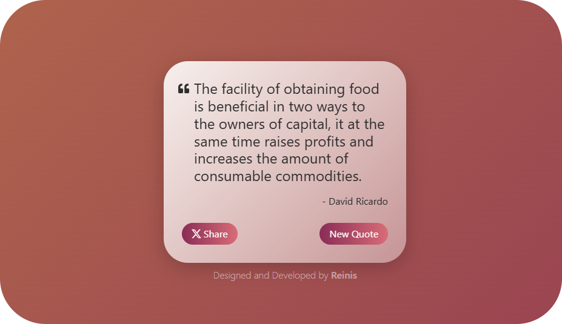
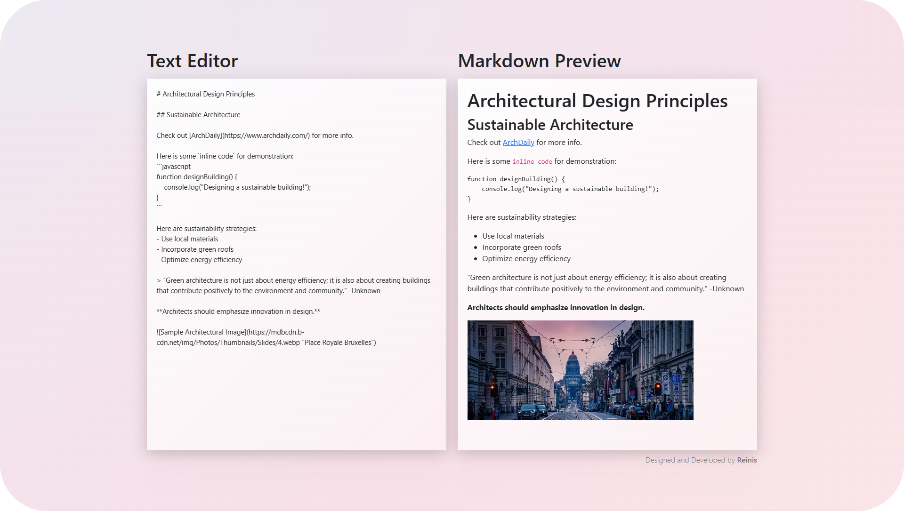
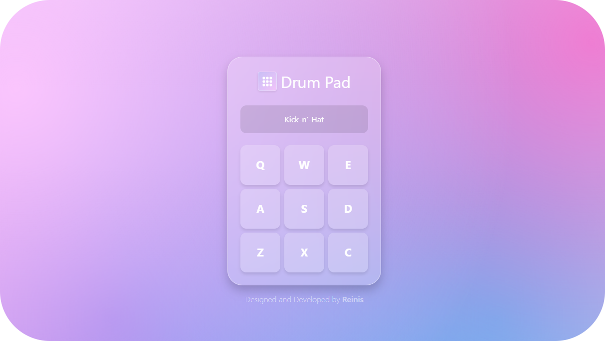
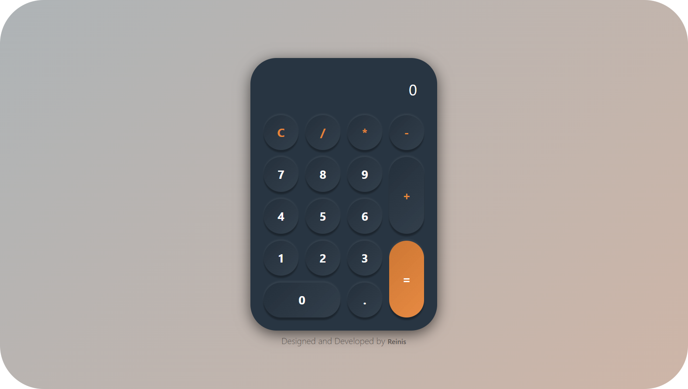
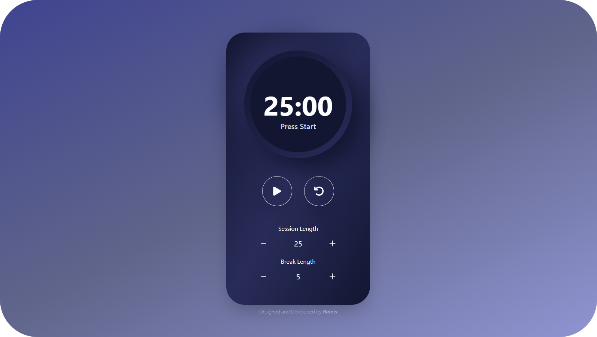

## ⚛️ Front End Libraries

Practical, interactive projects built using React, Bootstrap, Tailwind, and JS, demonstrating component-based design, state management, and API integration.

## 🚀 Projects Included

 
<table>
  <tr>
    <td align="center">
     
      
       <strong>Random Quote Machine</strong>
       Fetches and displays random quotes.
       <a href="https://random-quote-machine-01.netlify.app/">Live Demo</a>
    </td>
    <td align="center">
     
      
       <strong>Markdown Previewer</strong>
       Live preview of GitHub-flavored markdown.
       <a href="https://markdown-previewer-02.netlify.app/">Live Demo</a>
    </td>
  </tr>
  <tr>
    <td align="center">
     
      
       <strong>Drum Machine</strong>
       Interactive drum pads triggered by clicks or keys.
       <a href="https://drum-machine-01.netlify.app/">Live Demo</a>
    </td>
    <td align="center">
     
      
       <strong>JavaScript Calculator</strong>
       Fully functional calculator UI.
       <a href="https://javascript-calculator-02.netlify.app/">Live Demo</a>
    </td>
  </tr>
  <tr>
    <td align="center" colspan="2">
     
      
       <strong>25 + 5 Clock</strong>
       Pomodoro-style timer with session/break settings.
       <a href="#">Live Demo</a>
    </td>
  </tr>
</table>

---

## 🧠 What I Learned

- React fundamentals: components, props, state, and hooks  
- Passing data via props and context  
- Handling events and API integration 
- Styling with Bootstrap and Tailwind   
- Debugging and optimizing React components  

## 📜 License

This collection is open for learning and experimentation. Use it freely!
